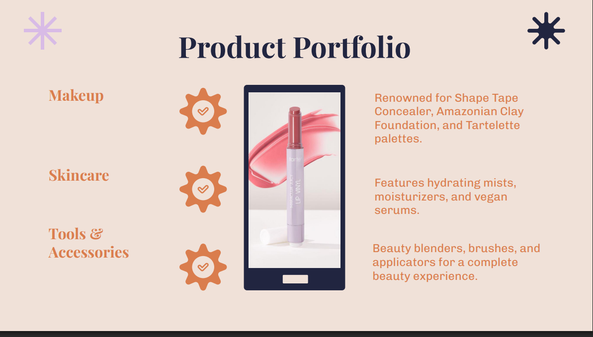
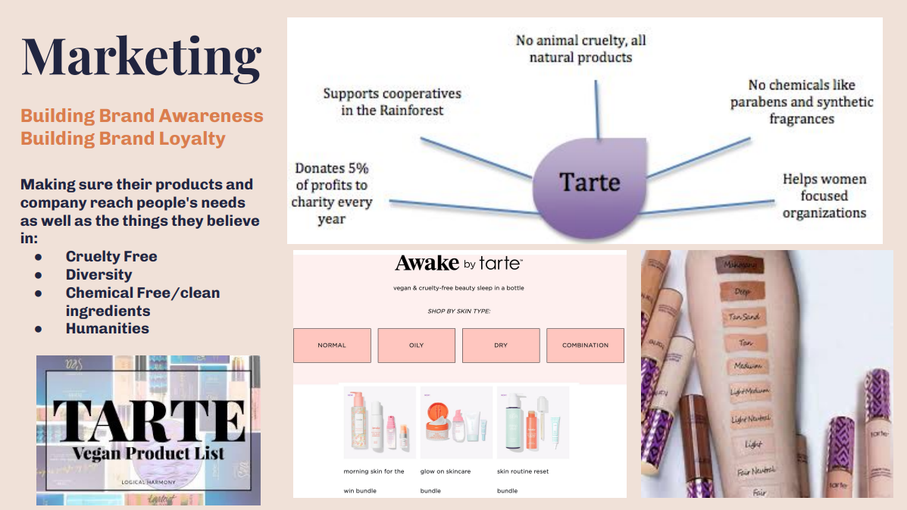
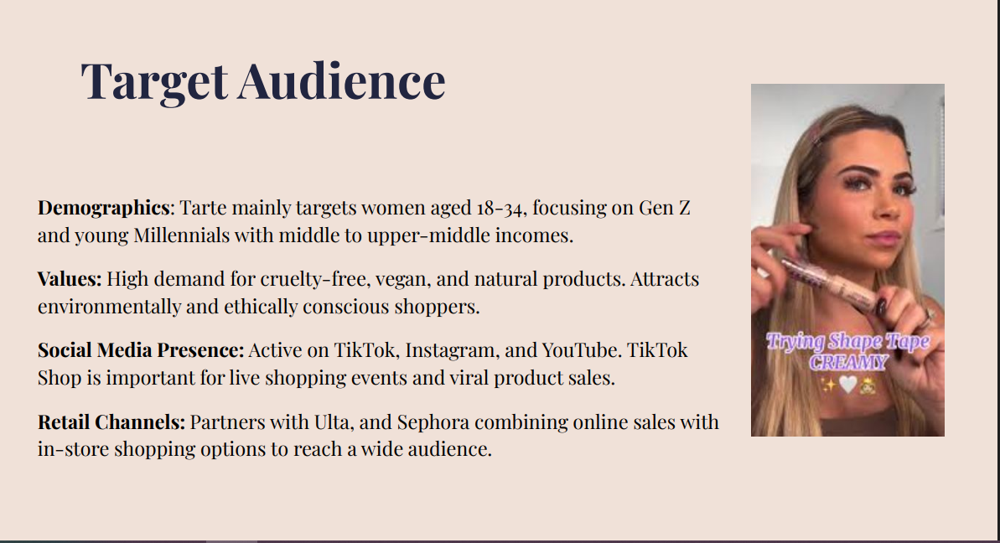
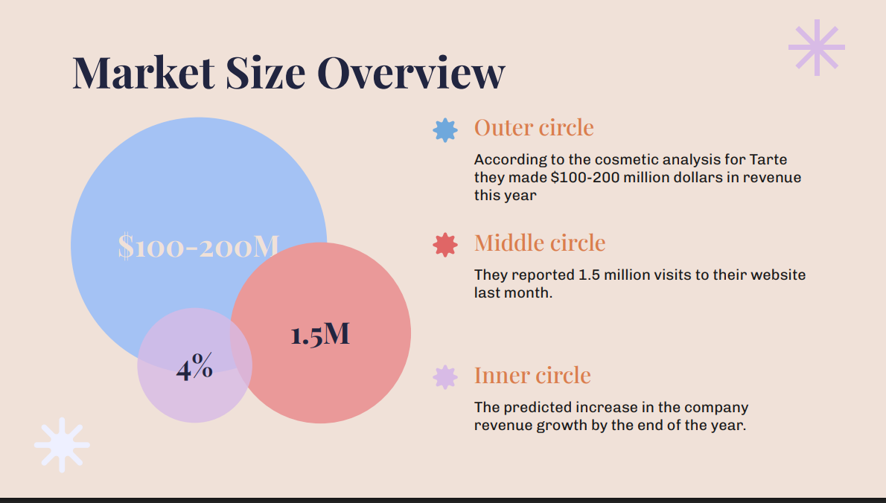

# 💄 Tarte Cosmetics — Brand & Marketing Analysis

*Brand Strategy | SWOT Analysis | Influencer Marketing | Social Media | Market Research*

Conducted a comprehensive marketing analysis of Tarte Cosmetics as part of MKT 141. Examined the brand's history, product portfolio, target audience (women aged 18–34, Gen Z and Millennials), and competitive positioning against Fenty Beauty, Too Faced, and Glossier. Analyzed Tarte's influencer marketing strategy including the viral #TrippinWithTarte campaign, open affiliate model on TikTok Shop, and virtual try-on technology that drove a **200% sales increase**. Evaluated market opportunities including subscription box expansion, product customization, and international growth strategy.

---

## 📌 Key Highlights

- Tarte generated **$100–200M in annual revenue** with 1.5 million monthly website visits and a projected 4% revenue growth rate
- TikTok Shop performance **surpassed sales expectations by 50%**, with the open affiliate model allowing any creator to link products and earn commissions
- Virtual try-on technology drove a **200% increase in sales**, a 30% increase in products added to carts, and a measurable drop in customer support calls
- **10.1 million Instagram followers** with highlights covering events, movements, and the iconic #trippinWithTarte influencer getaways
- SWOT analysis identified key strengths (cruelty-free positioning, influencer strategy, diverse product line) and growth opportunities (subscription boxes, product customization, international expansion)
- Competitive analysis benchmarked Tarte against Fenty Beauty, Too Faced, and Glossier, highlighting Tarte's differentiation through eco-conscious values and influencer-led campaigns

---

## 📄 Full Presentation

[Download Full Presentation (PDF)](MKT_141_Final_Presentation_-_Tarte.pdf)

---

## 🖼️ Project Screenshots

---

## 👥 Contributors

- **Britnee Bayas**
- Alexa Zuniga
- Arianna Giacoma Vitale
- Sophia Igneri
- Lilliana Ayres
